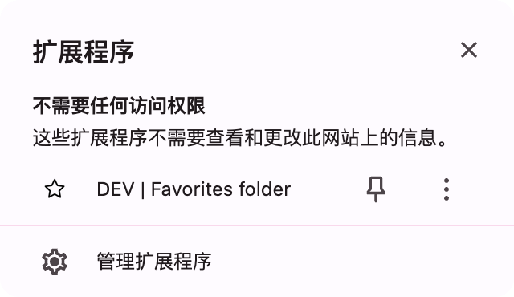

# SmartBookmark

## 如何安装

1. 进入 [release](https://github.com/targeral/favorites-folder/releases) 页面。
2. 下载最新的 release 压缩包，并解压。
3. 打开 [【Chrome 管理扩展程序】](chrome://extensions/) 或者[【Edge 管理扩展程序】](edge://extensions/) 页面。
4. 开启右上角的开发者模式。
5. 点击【加载已解压的扩展程序】，选择刚刚解压过的文件夹。选择完成后，插件添加到了扩展程序列表中。
6. 如果在浏览器界面没有看到新增的插件，需要手动显示它。

7. 此时安装成功了

## 如何使用

### 配置基本信息

